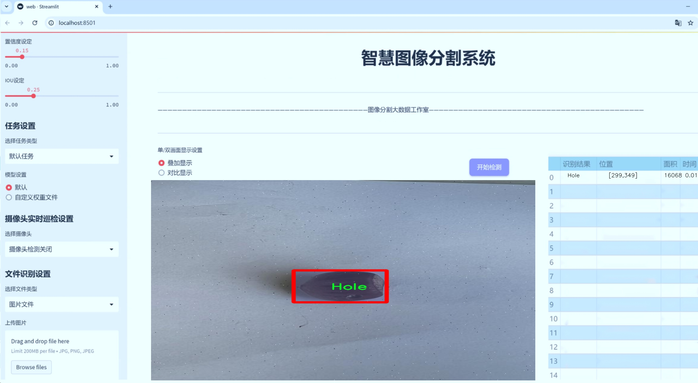
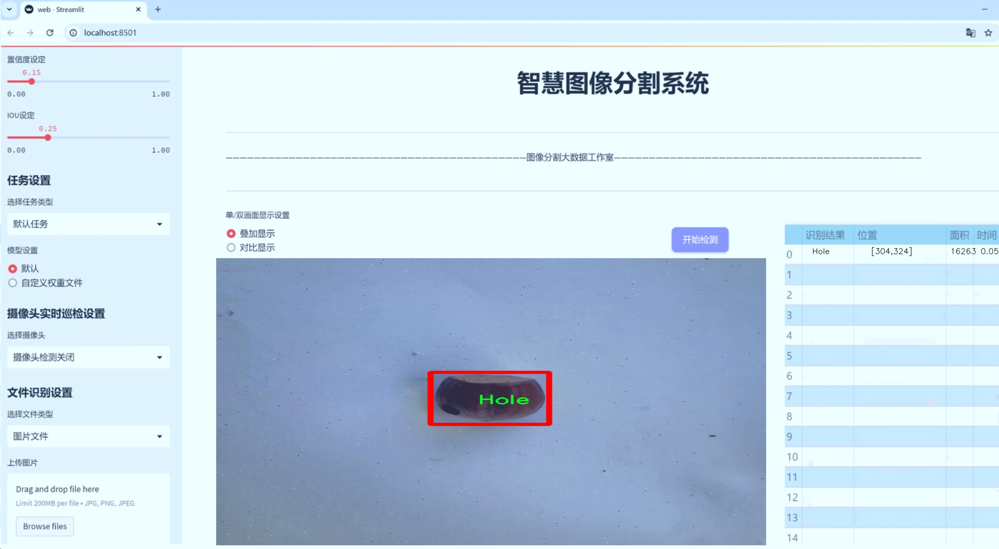
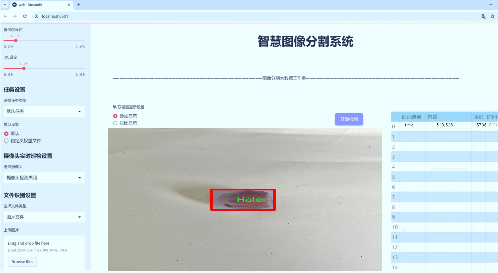
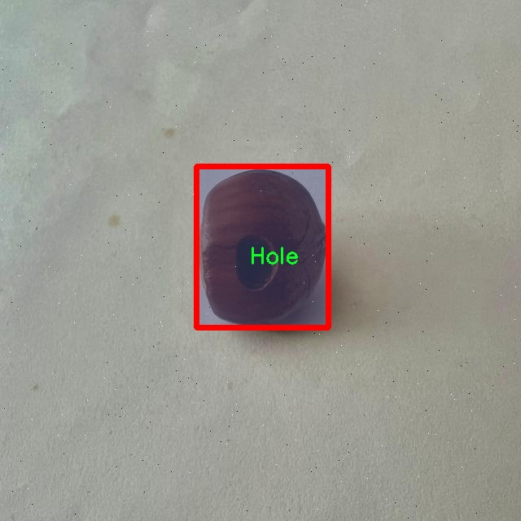
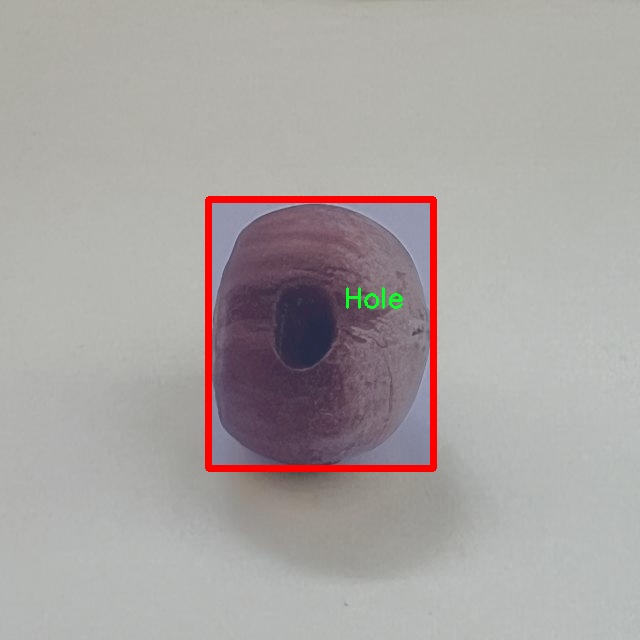
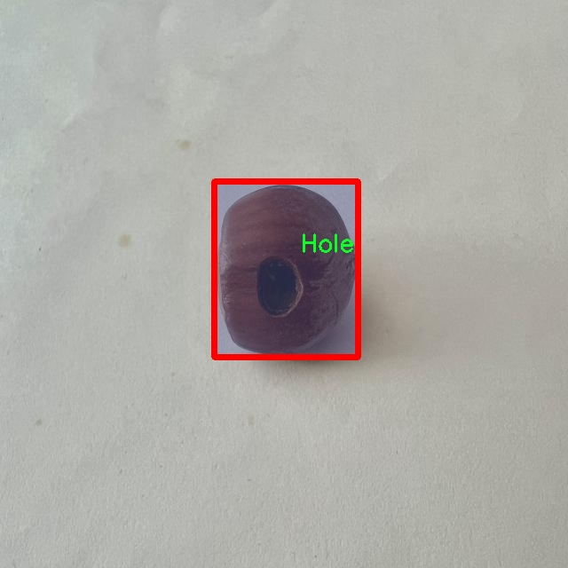
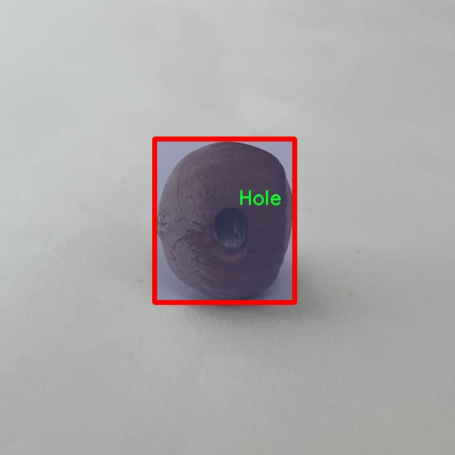
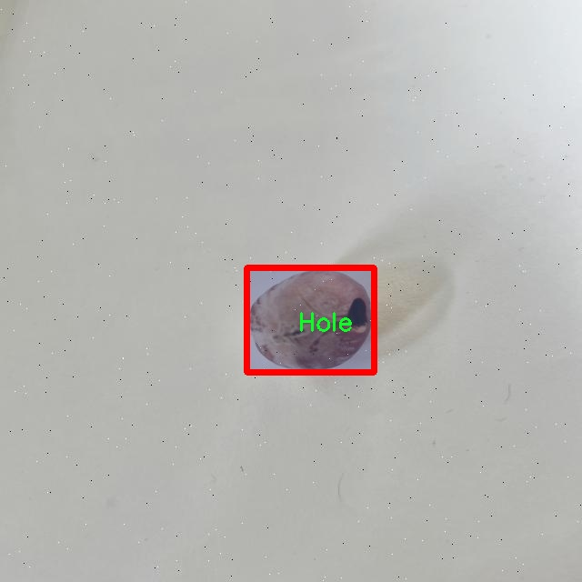

# 榛子缺陷分割系统： yolov8-seg-FocalModulation

### 1.研究背景与意义

[参考博客](https://gitee.com/YOLOv8_YOLOv11_Segmentation_Studio/projects)

[博客来源](https://kdocs.cn/l/cszuIiCKVNis)

研究背景与意义

榛子作为一种重要的坚果类农作物，因其丰富的营养价值和广泛的应用前景而受到越来越多的关注。然而，榛子的生产过程中，常常面临着各种缺陷问题，这些缺陷不仅影响了榛子的市场价值，还可能导致经济损失。因此，开发一种高效的榛子缺陷检测与分割系统显得尤为重要。传统的人工检测方法不仅耗时耗力，而且容易受到主观因素的影响，导致检测结果的不一致性。因此，基于计算机视觉和深度学习技术的自动化检测系统逐渐成为研究的热点。

近年来，YOLO（You Only Look Once）系列目标检测算法因其高效性和准确性在计算机视觉领域取得了显著的成果。YOLOv8作为该系列的最新版本，结合了更为先进的特征提取和处理技术，能够在保持高精度的同时实现实时检测。针对榛子缺陷的特征，改进YOLOv8算法以适应榛子图像的实例分割任务，能够有效提升缺陷检测的准确性和效率。通过对榛子缺陷进行精确的分割，研究者可以更好地分析和识别不同类型的缺陷，如裂纹、孔洞、涂漆、果仁质量等，从而为榛子的品质控制和市场管理提供科学依据。

本研究所使用的数据集包含3000张榛子图像，涵盖了五类缺陷。这一数据集的丰富性为模型的训练和验证提供了坚实的基础。通过对这些图像进行标注和分类，研究者能够深入挖掘榛子缺陷的特征，进而提升模型的学习能力和泛化能力。此外，数据集的多样性也有助于模型在不同环境和条件下的适应性，确保其在实际应用中的有效性。

在榛子产业中，缺陷检测不仅关乎产品质量，还直接影响到消费者的购买决策和企业的市场竞争力。因此，建立一个基于改进YOLOv8的榛子缺陷分割系统，不仅具有重要的学术价值，也具有显著的实际应用意义。通过自动化的缺陷检测系统，企业可以实现生产过程的智能化管理，提高生产效率，降低人力成本。同时，该系统还可以为榛子生产者提供实时的质量反馈，帮助他们及时调整生产策略，提升产品质量。

综上所述，基于改进YOLOv8的榛子缺陷分割系统的研究，不仅能够推动计算机视觉技术在农业领域的应用，还能为榛子产业的可持续发展提供有力支持。通过深入探讨榛子缺陷的检测与分割技术，研究者将为榛子产业的智能化、自动化发展贡献新的思路和方法，促进农业科技的进步与创新。

### 2.图片演示







注意：本项目提供完整的训练源码数据集和训练教程,由于此博客编辑较早,暂不提供权重文件（best.pt）,需要按照6.训练教程进行训练后实现上图效果。

### 3.视频演示

[3.1 视频演示](https://www.bilibili.com/video/BV1qxzFYYEn3/)

### 4.数据集信息

##### 4.1 数据集类别数＆类别名

nc: 5
names: ['Crack', 'Hole', 'Painted', 'kernel', 'quality']


##### 4.2 数据集信息简介

数据集信息展示

在本研究中，我们使用了名为“hazelnut-segmentation”的数据集，以支持改进YOLOv8-seg的榛子缺陷分割系统的训练与评估。该数据集专门针对榛子产品的质量检测与缺陷识别而设计，涵盖了多种榛子缺陷类型，旨在提高计算机视觉系统在农业产品质量控制中的应用效果。数据集包含五个主要类别，分别为“Crack”（裂纹）、“Hole”（孔洞）、“Painted”（涂漆）、“kernel”（果仁）和“quality”（质量），这些类别为研究提供了丰富的标注信息，使得模型能够在不同的缺陷场景中进行有效的学习和识别。

在数据集的构建过程中，研究团队通过收集和标注大量的榛子图像，确保每个类别的样本具有代表性和多样性。这些图像不仅涵盖了不同品种的榛子，还考虑了不同的生长环境和气候条件下的表现，确保模型在实际应用中能够适应各种情况。每个类别的图像都经过精细的标注，确保裂纹、孔洞、涂漆等缺陷的边界清晰可见，便于模型进行像素级的分割任务。

“Crack”类别主要指榛子表面出现的裂纹，这种缺陷通常会影响榛子的外观和市场价值；“Hole”类别则包括由于虫害或其他原因造成的孔洞，这类缺陷可能导致榛子的腐烂或变质；“Painted”类别涉及那些经过人工涂漆处理的榛子，这类样本在检测时需要特别注意涂层对外观的影响；“kernel”类别则是指正常的榛子果仁部分，这一类别的样本为模型提供了一个对比基准，以便更好地识别和分割缺陷区域；最后，“quality”类别则综合了榛子的整体质量评估，帮助模型理解在不同缺陷情况下榛子的市场价值。

通过对这些类别的深入分析，我们可以发现，榛子缺陷的多样性对模型的训练提出了更高的要求。为了提高YOLOv8-seg在榛子缺陷分割任务中的性能，我们不仅需要大量的标注数据，还需要考虑数据的平衡性，以确保每个类别在训练过程中都能得到充分的学习。为此，研究团队在数据集的构建过程中，特别注重对每个类别样本数量的均衡分配，以避免模型在某些类别上过拟合而在其他类别上表现不佳。

此外，数据集的使用还将结合数据增强技术，以进一步提升模型的鲁棒性。通过旋转、缩放、裁剪等方式生成更多样本，模型将能够在面对实际应用中可能遇到的各种变换时，依然保持良好的识别能力。这一策略不仅有助于提升模型的泛化能力，还能有效降低因数据不足而导致的过拟合风险。

综上所述，“hazelnut-segmentation”数据集为榛子缺陷分割系统的训练提供了坚实的基础。通过对五个类别的细致划分和丰富的样本数据，该数据集不仅为改进YOLOv8-seg提供了必要的训练素材，也为后续的研究和应用奠定了良好的基础。随着模型的不断优化，我们期待能够在榛子质量检测领域取得更为显著的成果。











### 5.项目依赖环境部署教程（零基础手把手教学）

[5.1 环境部署教程链接（零基础手把手教学）](https://www.bilibili.com/video/BV1jG4Ve4E9t/?vd_source=bc9aec86d164b67a7004b996143742dc)


[5.2 安装Python虚拟环境创建和依赖库安装视频教程链接（零基础手把手教学）](https://www.bilibili.com/video/BV1nA4VeYEze/?vd_source=bc9aec86d164b67a7004b996143742dc)

### 6.手把手YOLOV8-seg训练视频教程（零基础手把手教学）

[6.1 手把手YOLOV8-seg训练视频教程（零基础小白有手就能学会）](https://www.bilibili.com/video/BV1cA4VeYETe/?vd_source=bc9aec86d164b67a7004b996143742dc)


按照上面的训练视频教程链接加载项目提供的数据集，运行train.py即可开始训练



     Epoch   gpu_mem       box       obj       cls    labels  img_size
     1/200     0G   0.01576   0.01955  0.007536        22      1280: 100%|██████████| 849/849 [14:42<00:00,  1.04s/it]
               Class     Images     Labels          P          R     mAP@.5 mAP@.5:.95: 100%|██████████| 213/213 [01:14<00:00,  2.87it/s]
                 all       3395      17314      0.994      0.957      0.0957      0.0843

     Epoch   gpu_mem       box       obj       cls    labels  img_size
     2/200     0G   0.01578   0.01923  0.007006        22      1280: 100%|██████████| 849/849 [14:44<00:00,  1.04s/it]
               Class     Images     Labels          P          R     mAP@.5 mAP@.5:.95: 100%|██████████| 213/213 [01:12<00:00,  2.95it/s]
                 all       3395      17314      0.996      0.956      0.0957      0.0845

     Epoch   gpu_mem       box       obj       cls    labels  img_size
     3/200     0G   0.01561    0.0191  0.006895        27      1280: 100%|██████████| 849/849 [10:56<00:00,  1.29it/s]
               Class     Images     Labels          P          R     mAP@.5 mAP@.5:.95: 100%|███████   | 187/213 [00:52<00:00,  4.04it/s]
                 all       3395      17314      0.996      0.957      0.0957      0.0845


### 7.50+种全套YOLOV8-seg创新点加载调参实验视频教程（一键加载写好的改进模型的配置文件）

[7.1 50+种全套YOLOV8-seg创新点加载调参实验视频教程（一键加载写好的改进模型的配置文件）](https://www.bilibili.com/video/BV1Hw4VePEXv/?vd_source=bc9aec86d164b67a7004b996143742dc)

### YOLOV8-seg算法简介

原始YOLOv8-seg算法原理

YOLOv8-seg算法是YOLO系列中的一个重要进展，由Glenn-Jocher于2023年提出。作为YOLOv5的继承者，YOLOv8-seg在目标检测和实例分割领域中展现出了卓越的性能，其核心原理和设计理念在于对前代模型的优化与创新。YOLOv8-seg不仅保留了YOLO系列的基本框架，还引入了一系列新技术，以提升模型的准确性和效率。

首先，YOLOv8-seg在数据预处理方面延续了YOLOv5的策略，采用了多种数据增强手段，如马赛克增强、混合增强、空间扰动和颜色扰动。这些增强技术旨在提高模型的泛化能力，使其在面对复杂背景和多样化目标时，能够更好地识别和分割目标。通过这些预处理手段，YOLOv8-seg能够有效地扩展训练数据集，从而提升模型的鲁棒性。

在骨干网络结构方面，YOLOv8-seg的设计借鉴了YOLOv5的成功经验。YOLOv5的主干网络通过一系列步长为2的3×3卷积层进行特征图的降采样，并结合C3模块来强化特征提取。YOLOv8-seg在此基础上，进一步优化了C3模块，采用了新的C2f模块。C2f模块通过引入更多的分支结构，丰富了梯度回传时的特征流动，使得网络在学习过程中能够更好地捕捉到细粒度的特征信息。这种结构的改进使得YOLOv8-seg在处理复杂场景时，能够更准确地提取目标特征，从而提高分割精度。

YOLOv8-seg继续采用FPN（特征金字塔网络）和PAN（路径聚合网络）结构，以实现多尺度特征的融合。FPN-PAN结构通过上下采样和特征拼接，有效地整合了不同尺度的信息，使得模型在处理大目标和小目标时均能保持良好的性能。YOLOv8-seg在这一结构中，将C3模块替换为C2f模块，进一步提升了特征融合的效果，确保了多尺度信息的充分利用。

在检测头的设计上，YOLOv8-seg引入了解耦头结构，打破了传统的耦合检测头的局限。解耦头通过两条并行分支分别提取类别特征和位置特征，使得分类和定位任务的处理更加高效。每个分支使用1×1卷积进行特征处理，确保了分类和回归任务的独立性。这种设计不仅提高了模型的计算效率，还使得YOLOv8-seg在处理复杂场景时，能够更准确地定位和分类目标。

在标签分配策略方面，YOLOv8-seg采用了TOOD（Task-Oriented Object Detection）策略，解决了正负样本匹配的问题。与YOLOX的SimOTA策略不同，YOLOv8-seg的TOOD策略更加灵活，能够动态地分配标签。模型通过target bboxes和target scores进行损失计算，主要包括类别损失和位置损失。YOLOv8-seg的分类损失采用了Varifocal Loss（VFL），而回归损失则结合了CIoU Loss和DFL Loss。这种损失函数的设计使得模型在训练过程中，能够更加关注高质量的正样本，同时降低负样本对整体损失的影响，从而提升了模型的训练效果。

值得注意的是，YOLOv8-seg在目标检测的基础上，扩展了实例分割的能力。通过对特征图的细致处理，YOLOv8-seg能够实现对目标的精确分割，尤其是在复杂背景下的小目标检测上，表现尤为突出。这一能力的提升，得益于模型在特征提取和损失计算上的创新设计，使得YOLOv8-seg在实例分割任务中具备了更强的适应性和准确性。

总的来说，YOLOv8-seg算法通过对数据预处理、骨干网络、特征融合、检测头设计以及标签分配策略的全面优化，展现出了优越的性能。它不仅在目标检测任务中表现出色，更在实例分割领域中开辟了新的可能性。随着YOLOv8-seg的推出，计算机视觉领域的研究者和工程师们将能够更好地应对复杂场景下的目标识别与分割挑战，为实际应用提供了更为强大的技术支持。


### 9.系统功能展示（检测对象为举例，实际内容以本项目数据集为准）

图9.1.系统支持检测结果表格显示

  图9.2.系统支持置信度和IOU阈值手动调节

  图9.3.系统支持自定义加载权重文件best.pt(需要你通过步骤5中训练获得)

  图9.4.系统支持摄像头实时识别

  图9.5.系统支持图片识别

  图9.6.系统支持视频识别

  图9.7.系统支持识别结果文件自动保存

  图9.8.系统支持Excel导出检测结果数据


### 10.50+种全套YOLOV8-seg创新点原理讲解（非科班也可以轻松写刊发刊，V11版本正在科研待更新）

#### 10.1 由于篇幅限制，每个创新点的具体原理讲解就不一一展开，具体见下列网址中的创新点对应子项目的技术原理博客网址【Blog】：


[10.1 50+种全套YOLOV8-seg创新点原理讲解链接](https://gitee.com/qunmasj/good)

#### 10.2 部分改进模块原理讲解(完整的改进原理见上图和技术博客链接)【如果此小节的图加载失败可以通过CSDN或者Github搜索该博客的标题访问原始博客，原始博客图片显示正常】

### YOLOv8简介
#### Backbone
Darknet-53
53指的是“52层卷积”+output layer。

借鉴了其他算法的这些设计思想

借鉴了VGG的思想，使用了较多的3×3卷积，在每一次池化操作后，将通道数翻倍；

借鉴了network in network的思想，使用全局平均池化（global average pooling）做预测，并把1×1的卷积核置于3×3的卷积核之间，用来压缩特征；（我没找到这一步体现在哪里）


使用了批归一化层稳定模型训练，加速收敛，并且起到正则化作用。

    以上三点为Darknet19借鉴其他模型的点。Darknet53当然是在继承了Darknet19的这些优点的基础上再新增了下面这些优点的。因此列在了这里

借鉴了ResNet的思想，在网络中大量使用了残差连接，因此网络结构可以设计的很深，并且缓解了训练中梯度消失的问题，使得模型更容易收敛。

使用步长为2的卷积层代替池化层实现降采样。（这一点在经典的Darknet-53上是很明显的，output的长和宽从256降到128，再降低到64，一路降低到8，应该是通过步长为2的卷积层实现的；在YOLOv8的卷积层中也有体现，比如图中我标出的这些位置）

#### 特征融合

模型架构图如下

  Darknet-53的特点可以这样概括：（Conv卷积模块+Residual Block残差块）串行叠加4次

  Conv卷积层+Residual Block残差网络就被称为一个stage


上面红色指出的那个，原始的Darknet-53里面有一层 卷积，在YOLOv8里面，把一层卷积移除了

为什么移除呢？

        原始Darknet-53模型中间加的这个卷积层做了什么？滤波器（卷积核）的个数从 上一个卷积层的512个，先增加到1024个卷积核，然后下一层卷积的卷积核的个数又降低到512个

        移除掉这一层以后，少了1024个卷积核，就可以少做1024次卷积运算，同时也少了1024个3×3的卷积核的参数，也就是少了9×1024个参数需要拟合。这样可以大大减少了模型的参数，（相当于做了轻量化吧）

        移除掉这个卷积层，可能是因为作者发现移除掉这个卷积层以后，模型的score有所提升，所以才移除掉的。为什么移除掉以后，分数有所提高呢？可能是因为多了这些参数就容易，参数过多导致模型在训练集删过拟合，但是在测试集上表现很差，最终模型的分数比较低。你移除掉这个卷积层以后，参数减少了，过拟合现象不那么严重了，泛化能力增强了。当然这个是，拿着你做实验的结论，反过来再找补，再去强行解释这种现象的合理性。


通过MMdetection官方绘制册这个图我们可以看到，进来的这张图片经过一个“Feature Pyramid Network(简称FPN)”，然后最后的P3、P4、P5传递给下一层的Neck和Head去做识别任务。 PAN（Path Aggregation Network）


“FPN是自顶向下，将高层的强语义特征传递下来。PAN就是在FPN的后面添加一个自底向上的金字塔，对FPN补充，将低层的强定位特征传递上去，

FPN是自顶（小尺寸，卷积次数多得到的结果，语义信息丰富）向下（大尺寸，卷积次数少得到的结果），将高层的强语义特征传递下来，对整个金字塔进行增强，不过只增强了语义信息，对定位信息没有传递。PAN就是针对这一点，在FPN的后面添加一个自底（卷积次数少，大尺寸）向上（卷积次数多，小尺寸，语义信息丰富）的金字塔，对FPN补充，将低层的强定位特征传递上去，又被称之为“双塔战术”。

FPN层自顶向下传达强语义特征，而特征金字塔则自底向上传达强定位特征，两两联手，从不同的主干层对不同的检测层进行参数聚合,这样的操作确实很皮。
#### 自底向上增强


而 PAN（Path Aggregation Network）是对 FPN 的一种改进，它的设计理念是在 FPN 后面添加一个自底向上的金字塔。PAN 引入了路径聚合的方式，通过将浅层特征图（低分辨率但语义信息较弱）和深层特征图（高分辨率但语义信息丰富）进行聚合，并沿着特定的路径传递特征信息，将低层的强定位特征传递上去。这样的操作能够进一步增强多尺度特征的表达能力，使得 PAN 在目标检测任务中表现更加优秀。


### Gold-YOLO简介
YOLO系列模型面世至今已有8年，由于其优异的性能，已成为目标检测领域的标杆。在系列模型经过十多个不同版本的改进发展逐渐稳定完善的今天，研究人员更多关注于单个计算模块内结构的精细调整，或是head部分和训练方法上的改进。但这并不意味着现有模式已是最优解。

当前YOLO系列模型通常采用类FPN方法进行信息融合，而这一结构在融合跨层信息时存在信息损失的问题。针对这一问题，我们提出了全新的信息聚集-分发（Gather-and-Distribute Mechanism）GD机制，通过在全局视野上对不同层级的特征进行统一的聚集融合并分发注入到不同层级中，构建更加充分高效的信息交互融合机制，并基于GD机制构建了Gold-YOLO。在COCO数据集中，我们的Gold-YOLO超越了现有的YOLO系列，实现了精度-速度曲线上的SOTA。


精度和速度曲线（TensorRT7）


精度和速度曲线（TensorRT8）
传统YOLO的问题
在检测模型中，通常先经过backbone提取得到一系列不同层级的特征，FPN利用了backbone的这一特点，构建了相应的融合结构：不层级的特征包含着不同大小物体的位置信息，虽然这些特征包含的信息不同，但这些特征在相互融合后能够互相弥补彼此缺失的信息，增强每一层级信息的丰富程度，提升网络性能。

原始的FPN结构由于其层层递进的信息融合模式，使得相邻层的信息能够充分融合，但也导致了跨层信息融合存在问题：当跨层的信息进行交互融合时，由于没有直连的交互通路，只能依靠中间层充当“中介”进行融合，导致了一定的信息损失。之前的许多工作中都关注到了这一问题，而解决方案通常是通过添加shortcut增加更多的路径，以增强信息流动。

然而传统的FPN结构即便改进后，由于网络中路径过多，且交互方式不直接，基于FPN思想的信息融合结构仍然存在跨层信息交互困难和信息损失的问题。

#### Gold-YOLO：全新的信息融合交互机制


#### Gold-YOLO架构
参考该博客提出的一种全新的信息交互融合机制：信息聚集-分发机制(Gather-and-Distribute Mechanism)。该机制通过在全局上融合不同层次的特征得到全局信息，并将全局信息注入到不同层级的特征中，实现了高效的信息交互和融合。在不显著增加延迟的情况下GD机制显著增强了Neck部分的信息融合能力，提高了模型对不同大小物体的检测能力。

GD机制通过三个模块实现：信息对齐模块(FAM)、信息融合模块(IFM)和信息注入模块(Inject)。

信息对齐模块负责收集并对齐不同层级不同大小的特征

信息融合模块通过使用卷积或Transformer算子对对齐后的的特征进行融合，得到全局信息

信息注入模块将全局信息注入到不同层级中

在Gold-YOLO中，针对模型需要检测不同大小的物体的需要，并权衡精度和速度，我们构建了两个GD分支对信息进行融合：低层级信息聚集-分发分支(Low-GD)和高层级信息聚集-分发分支(High-GD)，分别基于卷积和transformer提取和融合特征信息。

此外,为了促进局部信息的流动，我们借鉴现有工作，构建了一个轻量级的邻接层融合模块，该模块在局部尺度上结合了邻近层的特征，进一步提升了模型性能。我们还引入并验证了预训练方法对YOLO模型的有效性，通过在ImageNet 1K上使用MAE方法对主干进行预训练，显著提高了模型的收敛速度和精度。


### 11.项目核心源码讲解（再也不用担心看不懂代码逻辑）

#### 11.1 ultralytics\engine\results.py

以下是经过精简和注释的核心代码部分，保留了最重要的功能和结构。

```python
import numpy as np
import torch

class BaseTensor:
    """基础张量类，提供方便的设备处理和数据操作方法。"""

    def __init__(self, data, orig_shape) -> None:
        """
        初始化BaseTensor。

        参数:
            data (torch.Tensor | np.ndarray): 预测结果，例如边界框、掩码和关键点。
            orig_shape (tuple): 原始图像的形状。
        """
        assert isinstance(data, (torch.Tensor, np.ndarray))
        self.data = data  # 存储数据
        self.orig_shape = orig_shape  # 存储原始形状

    def cpu(self):
        """返回在CPU内存上的张量副本。"""
        return self.__class__(self.data.cpu(), self.orig_shape) if isinstance(self.data, torch.Tensor) else self

    def numpy(self):
        """返回张量的numpy数组副本。"""
        return self.__class__(self.data.numpy(), self.orig_shape) if isinstance(self.data, torch.Tensor) else self

    def cuda(self):
        """返回在GPU内存上的张量副本。"""
        return self.__class__(self.data.cuda(), self.orig_shape)

class Results:
    """存储和操作推理结果的类。"""

    def __init__(self, orig_img, path, names, boxes=None, masks=None, probs=None, keypoints=None) -> None:
        """初始化Results类。"""
        self.orig_img = orig_img  # 原始图像
        self.orig_shape = orig_img.shape[:2]  # 原始图像形状
        self.boxes = Boxes(boxes, self.orig_shape) if boxes is not None else None  # 检测到的边界框
        self.masks = Masks(masks, self.orig_shape) if masks is not None else None  # 检测到的掩码
        self.probs = Probs(probs) if probs is not None else None  # 分类概率
        self.keypoints = Keypoints(keypoints, self.orig_shape) if keypoints is not None else None  # 关键点
        self.names = names  # 类别名称
        self.path = path  # 图像路径

    def plot(self):
        """在输入图像上绘制检测结果并返回标注后的图像。"""
        # 这里省略具体的绘制逻辑，假设会处理边界框、掩码等
        pass

class Boxes(BaseTensor):
    """存储和操作检测框的类。"""

    def __init__(self, boxes, orig_shape) -> None:
        """初始化Boxes类。"""
        super().__init__(boxes, orig_shape)

    @property
    def xyxy(self):
        """返回xyxy格式的边界框。"""
        return self.data[:, :4]  # 提取前四列作为边界框坐标

class Masks(BaseTensor):
    """存储和操作检测掩码的类。"""

    def __init__(self, masks, orig_shape) -> None:
        """初始化Masks类。"""
        super().__init__(masks, orig_shape)

class Keypoints(BaseTensor):
    """存储和操作检测关键点的类。"""

    def __init__(self, keypoints, orig_shape) -> None:
        """初始化Keypoints类。"""
        super().__init__(keypoints, orig_shape)

class Probs(BaseTensor):
    """存储和操作分类预测的类。"""

    def __init__(self, probs, orig_shape=None) -> None:
        """初始化Probs类。"""
        super().__init__(probs, orig_shape)

    @property
    def top1(self):
        """返回top 1类的索引。"""
        return int(self.data.argmax())  # 返回最大值的索引
```

### 代码说明：
1. **BaseTensor**: 这是一个基础类，提供了对张量的基本操作，包括在不同设备（CPU/GPU）之间的转换，以及返回numpy数组的功能。
2. **Results**: 这个类用于存储推理结果，包括原始图像、边界框、掩码、概率和关键点等。它还包含绘制结果的功能。
3. **Boxes, Masks, Keypoints, Probs**: 这些类继承自`BaseTensor`，分别用于处理边界框、掩码、关键点和分类概率，提供了特定于这些数据类型的功能。

代码中的具体实现细节（如绘制逻辑）被省略，以保持核心结构的简洁性。

该文件 `ultralytics/engine/results.py` 是 Ultralytics YOLO 模型的一个重要组成部分，主要用于处理推理结果，包括检测框、掩码和关键点等。文件中定义了多个类，主要包括 `BaseTensor`、`Results`、`Boxes`、`Masks`、`Keypoints` 和 `Probs`，这些类提供了对推理结果的存储和操作功能。

首先，`BaseTensor` 类是一个基础类，提供了一些用于张量操作的额外方法，如在 CPU 和 GPU 之间的转换、转换为 NumPy 数组等。它的构造函数接受数据和原始图像的形状，并提供了获取张量形状、长度和索引的功能。

接下来是 `Results` 类，它用于存储和操作推理结果。构造函数接受原始图像、图像路径、类别名称以及可选的检测框、掩码、概率和关键点。该类包含多个属性，如原始图像、原始形状、检测框、掩码、概率、关键点等，并提供了更新结果、获取结果长度、转换设备等方法。`plot` 方法用于在输入图像上绘制检测结果，包括检测框、掩码、关键点等，并支持自定义参数，如线宽、字体大小等。

`Boxes` 类用于存储和操作检测框。它从 `BaseTensor` 继承而来，提供了对检测框的各种格式（如 xyxy、xywh、归一化格式等）的访问。该类还提供了对检测框的信心值和类别值的访问。

`Masks` 类用于存储和操作检测掩码。它同样继承自 `BaseTensor`，并提供了对掩码的像素坐标和归一化坐标的访问。

`Keypoints` 类用于存储和操作检测关键点。它包含关键点的坐标和置信度，并提供了相应的访问方法。

最后，`Probs` 类用于存储和操作分类预测的概率，提供了获取前 1 和前 5 类别的索引及其置信度的方法。

总体而言，该文件提供了一套完整的接口，用于处理 YOLO 模型的推理结果，支持多种操作和数据格式转换，方便后续的结果分析和可视化。

#### 11.2 ultralytics\nn\extra_modules\ops_dcnv3\modules\dcnv3.py

以下是经过简化和注释的核心代码部分：

```python
import torch
from torch import nn
import torch.nn.functional as F
from torch.nn.init import xavier_uniform_, constant_

class DCNv3(nn.Module):
    def __init__(self, channels=64, kernel_size=3, stride=1, pad=1, dilation=1, group=4, offset_scale=1.0, center_feature_scale=False, remove_center=False):
        """
        初始化DCNv3模块
        :param channels: 输入通道数
        :param kernel_size: 卷积核大小
        :param stride: 步幅
        :param pad: 填充
        :param dilation: 膨胀
        :param group: 分组数
        :param offset_scale: 偏移缩放因子
        :param center_feature_scale: 是否使用中心特征缩放
        :param remove_center: 是否移除中心
        """
        super().__init__()
        
        # 检查通道数是否能被分组数整除
        if channels % group != 0:
            raise ValueError(f'channels must be divisible by group, but got {channels} and {group}')
        
        self.channels = channels
        self.kernel_size = kernel_size
        self.stride = stride
        self.dilation = dilation
        self.pad = pad
        self.group = group
        self.group_channels = channels // group
        self.offset_scale = offset_scale
        self.center_feature_scale = center_feature_scale
        self.remove_center = int(remove_center)

        # 初始化卷积层和线性层
        self.dw_conv = nn.Conv2d(channels, channels, kernel_size, stride=1, padding=(kernel_size - 1) // 2, groups=channels)
        self.offset = nn.Linear(channels, group * (kernel_size * kernel_size - remove_center) * 2)
        self.mask = nn.Linear(channels, group * (kernel_size * kernel_size - remove_center))
        self.input_proj = nn.Linear(channels, channels)
        self.output_proj = nn.Linear(channels, channels)
        self._reset_parameters()

        # 如果使用中心特征缩放，初始化相关参数
        if center_feature_scale:
            self.center_feature_scale_proj_weight = nn.Parameter(torch.zeros((group, channels), dtype=torch.float))
            self.center_feature_scale_proj_bias = nn.Parameter(torch.tensor(0.0, dtype=torch.float).repeat(group))

    def _reset_parameters(self):
        """重置参数，初始化权重和偏置"""
        constant_(self.offset.weight.data, 0.)
        constant_(self.offset.bias.data, 0.)
        constant_(self.mask.weight.data, 0.)
        constant_(self.mask.bias.data, 0.)
        xavier_uniform_(self.input_proj.weight.data)
        constant_(self.input_proj.bias.data, 0.)
        xavier_uniform_(self.output_proj.weight.data)
        constant_(self.output_proj.bias.data, 0.)

    def forward(self, input):
        """
        前向传播
        :param input: 输入张量 (N, H, W, C)
        :return: 输出张量 (N, H, W, C)
        """
        N, H, W, _ = input.shape

        # 输入投影
        x = self.input_proj(input)
        x_proj = x  # 保存输入投影以备后用

        # 转换输入格式并进行深度卷积
        x1 = input.permute(0, 3, 1, 2)  # 转换为 (N, C, H, W)
        x1 = self.dw_conv(x1).permute(0, 2, 3, 1)  # 进行深度卷积并转换回 (N, H, W, C)

        # 计算偏移和掩码
        offset = self.offset(x1)
        mask = self.mask(x1).reshape(N, H, W, self.group, -1)
        mask = F.softmax(mask, dim=-1).reshape(N, H, W, -1)

        # 使用DCNv3核心函数进行卷积操作
        x = self._dcnv3_core(x, offset, mask)

        # 如果使用中心特征缩放，进行相应的处理
        if self.center_feature_scale:
            center_feature_scale = self._center_feature_scale(x1)
            x = x * (1 - center_feature_scale) + x_proj * center_feature_scale

        # 输出投影
        x = self.output_proj(x)
        return x

    def _dcnv3_core(self, x, offset, mask):
        """DCNv3核心卷积操作"""
        # 这里应调用DCNv3的核心实现，具体实现未给出
        # 假设返回处理后的x
        return x  # 仅为示例，实际应调用相应的卷积函数

    def _center_feature_scale(self, x1):
        """计算中心特征缩放"""
        # 这里应实现中心特征缩放的计算，具体实现未给出
        return torch.zeros_like(x1)  # 仅为示例，实际应返回计算结果
```

### 代码注释说明：
1. **类的定义**：`DCNv3`类是深度可分离卷积的实现，包含初始化参数、重置参数、前向传播等方法。
2. **参数检查**：在初始化时检查输入通道数是否能被分组数整除。
3. **卷积和线性层**：定义了深度卷积层和线性层用于特征提取和输出。
4. **前向传播**：实现了输入的投影、深度卷积、偏移和掩码的计算，以及最终的输出。
5. **中心特征缩放**：如果启用中心特征缩放，则进行相应的计算。
6. **核心卷积操作**：`_dcnv3_core`方法应实现DCNv3的核心卷积逻辑（具体实现未给出）。

以上是对核心代码的提炼和详细注释，帮助理解DCNv3模块的结构和功能。

这个文件是一个实现深度学习模块的Python代码，主要用于构建DCNv3（Deformable Convolutional Networks v3）模块。该模块在计算机视觉任务中广泛应用，特别是在目标检测和分割等领域。代码中包含多个类和函数，下面是对其主要部分的详细说明。

首先，文件导入了一些必要的库，包括PyTorch和一些自定义的函数和模块。接着，定义了两个类`to_channels_first`和`to_channels_last`，它们的作用是改变输入张量的通道维度顺序，以便于后续的操作。这在处理不同格式的张量时非常有用，比如从“通道最后”格式转换为“通道第一”格式。

接下来，`build_norm_layer`函数用于构建归一化层，支持批归一化（Batch Normalization）和层归一化（Layer Normalization），并根据输入和输出格式进行适当的维度转换。`build_act_layer`函数则用于构建激活函数层，支持ReLU、SiLU和GELU等激活函数。

`_is_power_of_2`函数用于检查一个数是否是2的幂，这在DCNv3的实现中是一个性能优化的建议，因为某些操作在CUDA实现中对2的幂的维度处理更高效。

`CenterFeatureScaleModule`类实现了一个中心特征缩放模块，用于根据输入的查询特征计算中心特征缩放因子。

`DCNv3_pytorch`类是DCNv3模块的具体实现。构造函数中定义了多个参数，包括通道数、卷积核大小、步幅、填充、扩张率、分组数等。该类还包含了深度可分离卷积（dw_conv）、偏移量（offset）、掩码（mask）和输入输出投影（input_proj和output_proj）的线性层。`_reset_parameters`方法用于初始化这些层的参数。

`forward`方法是DCNv3模块的前向传播逻辑。它首先对输入进行投影，然后通过深度可分离卷积计算偏移量和掩码。接着，调用`dcnv3_core_pytorch`函数进行变形卷积操作。最后，如果启用了中心特征缩放，则会根据计算得到的缩放因子调整输出特征。

`DCNv3`类是另一个DCNv3模块的实现，主要是对`DCNv3_pytorch`类的简化和优化，使用了自定义的卷积类`Conv`。它的构造函数和前向传播逻辑与前者类似，但在某些实现细节上有所不同。

`DCNv3_DyHead`类是DCNv3模块的动态头实现，主要用于处理特定的输入和输出格式。它的前向传播方法使用了DCNv3的功能，并在最后通过线性层进行输出投影。

整体来看，这个文件实现了DCNv3模块的多个变体，提供了灵活的参数配置和高效的前向传播逻辑，适用于各种计算机视觉任务。

#### 11.3 ultralytics\nn\extra_modules\ops_dcnv3\modules\__init__.py

以下是代码中最核心的部分，并附上详细的中文注释：

```python
# 导入DCNv3相关模块
from .dcnv3 import DCNv3, DCNv3_pytorch, DCNv3_DyHead

# 以上代码从当前包的dcnv3模块中导入了三个类或函数：
# 1. DCNv3：可能是一个实现了深度可分离卷积的网络结构。
# 2. DCNv3_pytorch：可能是一个基于PyTorch框架的DCNv3实现。
# 3. DCNv3_DyHead：可能是一个动态头部的实现，用于在网络中处理不同的任务或特征。

# 这些导入的模块通常用于构建和训练深度学习模型，特别是在计算机视觉任务中。
```

以上是对代码的核心部分进行了保留和详细注释。

这个程序文件是一个Python模块的初始化文件，位于`ultralytics/nn/extra_modules/ops_dcnv3/modules/`目录下。文件的开头包含了一些版权信息，表明该代码属于OpenGVLab，并且受MIT许可证的保护。这意味着用户可以自由使用、修改和分发该代码，只要遵循许可证的条款。

在文件的主体部分，使用了`from ... import ...`语句导入了三个类或函数：`DCNv3`、`DCNv3_pytorch`和`DCNv3_DyHead`。这些导入语句表明该模块依赖于`dcnv3`模块中的这些组件。具体来说：

- `DCNv3`可能是一个实现了某种深度学习操作的类，通常与卷积神经网络（CNN）相关。
- `DCNv3_pytorch`可能是一个针对PyTorch框架的实现，表明该模块可以与PyTorch深度学习库一起使用。
- `DCNv3_DyHead`可能是一个与动态头部（Dynamic Head）相关的组件，通常用于目标检测或图像分割等任务。

通过这些导入，用户可以在使用该模块时直接访问这些功能，而无需在代码中单独导入它们。这种做法提高了代码的可读性和模块化，使得用户能够更方便地使用和扩展该模块的功能。

#### 11.4 ultralytics\models\sam\modules\encoders.py

以下是经过简化并添加详细中文注释的核心代码部分：

```python
import torch
import torch.nn as nn
import torch.nn.functional as F

class ImageEncoderViT(nn.Module):
    """
    使用视觉变换器（ViT）架构的图像编码器，将图像编码为紧凑的潜在空间。
    编码器将图像分割为多个补丁，并通过一系列变换块处理这些补丁。
    最终的编码表示通过一个颈部模块生成。
    """

    def __init__(self, img_size: int = 1024, patch_size: int = 16, embed_dim: int = 768, depth: int = 12, out_chans: int = 256) -> None:
        """
        初始化图像编码器的参数。

        Args:
            img_size (int): 输入图像的大小（假设为正方形）。
            patch_size (int): 每个补丁的大小。
            embed_dim (int): 补丁嵌入的维度。
            depth (int): ViT的深度（变换块的数量）。
            out_chans (int): 输出通道数。
        """
        super().__init__()
        self.img_size = img_size

        # 补丁嵌入模块，将图像分割为补丁并进行嵌入
        self.patch_embed = PatchEmbed(
            kernel_size=(patch_size, patch_size),
            stride=(patch_size, patch_size),
            in_chans=3,  # 输入图像通道数
            embed_dim=embed_dim,
        )

        # 位置嵌入（可选）
        self.pos_embed = nn.Parameter(torch.zeros(1, img_size // patch_size, img_size // patch_size, embed_dim))

        # 变换块列表
        self.blocks = nn.ModuleList([Block(embed_dim) for _ in range(depth)])

        # 颈部模块，用于进一步处理输出
        self.neck = nn.Sequential(
            nn.Conv2d(embed_dim, out_chans, kernel_size=1, bias=False),
            nn.LayerNorm(out_chans),
            nn.Conv2d(out_chans, out_chans, kernel_size=3, padding=1, bias=False),
            nn.LayerNorm(out_chans),
        )

    def forward(self, x: torch.Tensor) -> torch.Tensor:
        """处理输入，通过补丁嵌入、位置嵌入、变换块和颈部模块。"""
        x = self.patch_embed(x)  # 进行补丁嵌入
        if self.pos_embed is not None:
            x = x + self.pos_embed  # 添加位置嵌入
        for blk in self.blocks:
            x = blk(x)  # 通过每个变换块
        return self.neck(x.permute(0, 3, 1, 2))  # 通过颈部模块并调整维度


class PatchEmbed(nn.Module):
    """图像到补丁嵌入的模块。"""

    def __init__(self, kernel_size: Tuple[int, int] = (16, 16), stride: Tuple[int, int] = (16, 16), in_chans: int = 3, embed_dim: int = 768) -> None:
        """
        初始化补丁嵌入模块。

        Args:
            kernel_size (Tuple): 卷积核大小。
            stride (Tuple): 卷积步幅。
            in_chans (int): 输入图像通道数。
            embed_dim (int): 补丁嵌入维度。
        """
        super().__init__()
        self.proj = nn.Conv2d(in_chans, embed_dim, kernel_size=kernel_size, stride=stride)

    def forward(self, x: torch.Tensor) -> torch.Tensor:
        """通过卷积计算补丁嵌入，并调整输出的维度。"""
        return self.proj(x).permute(0, 2, 3, 1)  # 将输出从 [B, C, H, W] 转换为 [B, H, W, C]


class Block(nn.Module):
    """变换块，包含多头注意力和前馈网络。"""

    def __init__(self, dim: int, num_heads: int = 8) -> None:
        """
        初始化变换块。

        Args:
            dim (int): 输入通道数。
            num_heads (int): 注意力头的数量。
        """
        super().__init__()
        self.norm1 = nn.LayerNorm(dim)  # 归一化层
        self.attn = Attention(dim, num_heads)  # 注意力层
        self.norm2 = nn.LayerNorm(dim)  # 归一化层
        self.mlp = MLPBlock(dim)  # 前馈网络

    def forward(self, x: torch.Tensor) -> torch.Tensor:
        """执行变换块的前向传播。"""
        shortcut = x
        x = self.norm1(x)  # 归一化
        x = self.attn(x)  # 注意力机制
        x = shortcut + x  # 残差连接
        return x + self.mlp(self.norm2(x))  # 通过前馈网络并返回


class Attention(nn.Module):
    """多头注意力模块。"""

    def __init__(self, dim: int, num_heads: int = 8) -> None:
        """
        初始化注意力模块。

        Args:
            dim (int): 输入通道数。
            num_heads (int): 注意力头的数量。
        """
        super().__init__()
        self.num_heads = num_heads
        self.qkv = nn.Linear(dim, dim * 3)  # 查询、键、值的线性变换
        self.proj = nn.Linear(dim, dim)  # 输出的线性变换

    def forward(self, x: torch.Tensor) -> torch.Tensor:
        """执行注意力机制的前向传播。"""
        B, H, W, _ = x.shape
        qkv = self.qkv(x).reshape(B, H * W, 3, self.num_heads, -1).permute(2, 0, 3, 1, 4)  # 计算 q, k, v
        q, k, v = qkv.reshape(3, B * self.num_heads, H * W, -1).unbind(0)  # 拆分 q, k, v
        attn = (q @ k.transpose(-2, -1))  # 计算注意力权重
        attn = attn.softmax(dim=-1)  # 归一化
        x = (attn @ v).view(B, self.num_heads, H, W, -1).permute(0, 2, 3, 1, 4).reshape(B, H, W, -1)  # 计算输出
        return self.proj(x)  # 返回最终输出
```

### 代码说明：
1. **ImageEncoderViT**：这是主要的图像编码器类，使用ViT架构。它负责将输入图像编码为潜在空间表示。
2. **PatchEmbed**：将输入图像分割为多个补丁并进行嵌入的模块。
3. **Block**：变换块，包含归一化、注意力机制和前馈网络。
4. **Attention**：实现多头注意力机制，计算查询、键、值的线性变换并返回注意力加权的输出。

通过这些核心部分的组合，模型能够有效地处理图像并提取有用的特征。

这个程序文件定义了一个图像编码器和一个提示编码器，主要用于处理图像数据并将其转换为紧凑的潜在空间表示。文件中包含多个类，每个类都有特定的功能。

首先，`ImageEncoderViT`类实现了基于视觉变换器（ViT）架构的图像编码器。它的构造函数接受多个参数，如输入图像的大小、补丁大小、输入通道数、嵌入维度、变换器块的深度、注意力头的数量等。该类的主要功能是将输入图像分割成多个补丁，并通过一系列变换器块处理这些补丁，最终生成图像的编码表示。编码过程包括补丁嵌入、位置嵌入（如果启用的话），以及通过多个变换器块的处理，最后通过一个“颈部”模块进一步处理输出。

接下来是`PromptEncoder`类，它用于编码不同类型的提示，包括点、框和掩码，以便输入到掩码解码器中。该类能够生成稀疏和密集的嵌入表示。构造函数中定义了多个参数，包括嵌入维度、输入图像大小、掩码输入通道数等。该类提供了多个方法来嵌入点、框和掩码，确保不同类型的输入都能被有效处理。

`PositionEmbeddingRandom`类用于生成随机空间频率的位置信息编码。它的构造函数接受参数来初始化随机频率矩阵，并提供方法来生成特定大小的位置信息编码。

`Block`类实现了变换器块，支持窗口注意力和残差传播。每个块包含规范化层、注意力机制和多层感知机（MLP）模块。

`Attention`类实现了多头注意力机制，支持相对位置嵌入。它的构造函数初始化了查询、键、值的线性变换，并在需要时初始化相对位置嵌入。

此外，文件中还定义了一些辅助函数，如`window_partition`和`window_unpartition`，用于将输入张量划分为非重叠窗口，以及从窗口中恢复原始序列。`get_rel_pos`和`add_decomposed_rel_pos`函数用于处理相对位置嵌入的计算。

最后，`PatchEmbed`类负责将图像转换为补丁嵌入，通过卷积操作实现。整体上，这个文件实现了一个复杂的图像编码和提示编码机制，适用于图像处理和计算机视觉任务。

#### 11.5 ultralytics\hub\utils.py

以下是经过简化并添加详细中文注释的核心代码部分：

```python
import os
import platform
import random
import sys
import threading
import time
from pathlib import Path
import requests
from ultralytics.utils import (ENVIRONMENT, LOGGER, ONLINE, RANK, SETTINGS, TESTS_RUNNING, TQDM, TryExcept, __version__,
                               colorstr, get_git_origin_url, is_colab, is_git_dir, is_pip_package)
from ultralytics.utils.downloads import GITHUB_ASSETS_NAMES

# 定义一些常量
PREFIX = colorstr('Ultralytics HUB: ')
HUB_API_ROOT = os.environ.get('ULTRALYTICS_HUB_API', 'https://api.ultralytics.com')

def requests_with_progress(method, url, **kwargs):
    """
    使用指定的方法和URL进行HTTP请求，并可选地显示进度条。

    参数:
        method (str): 使用的HTTP方法（例如 'GET', 'POST'）。
        url (str): 发送请求的URL。
        **kwargs (dict): 传递给底层 `requests.request` 函数的其他关键字参数。

    返回:
        (requests.Response): HTTP请求的响应对象。
    """
    progress = kwargs.pop('progress', False)  # 获取进度参数
    if not progress:
        return requests.request(method, url, **kwargs)  # 如果没有进度条，直接请求

    # 否则，使用流式请求以显示进度
    response = requests.request(method, url, stream=True, **kwargs)
    total = int(response.headers.get('content-length', 0))  # 获取响应内容的总大小
    try:
        pbar = TQDM(total=total, unit='B', unit_scale=True, unit_divisor=1024)  # 初始化进度条
        for data in response.iter_content(chunk_size=1024):  # 分块读取响应内容
            pbar.update(len(data))  # 更新进度条
        pbar.close()  # 关闭进度条
    except requests.exceptions.ChunkedEncodingError:  # 处理连接中断的异常
        response.close()
    return response  # 返回响应对象

class Events:
    """
    用于收集匿名事件分析的类。事件分析在设置中启用sync=True时启用，sync=False时禁用。

    属性:
        url (str): 发送匿名事件的URL。
        rate_limit (float): 发送事件的速率限制（秒）。
        metadata (dict): 包含环境元数据的字典。
        enabled (bool): 根据某些条件启用或禁用事件。
    """

    url = 'https://www.google-analytics.com/mp/collect?measurement_id=G-X8NCJYTQXM&api_secret=QLQrATrNSwGRFRLE-cbHJw'

    def __init__(self):
        """初始化Events对象，设置事件、速率限制和元数据的默认值。"""
        self.events = []  # 事件列表
        self.rate_limit = 60.0  # 速率限制（秒）
        self.t = 0.0  # 速率限制计时器（秒）
        self.metadata = {
            'cli': Path(sys.argv[0]).name == 'yolo',  # 检查是否为yolo命令行
            'install': 'git' if is_git_dir() else 'pip' if is_pip_package() else 'other',  # 安装方式
            'python': '.'.join(platform.python_version_tuple()[:2]),  # Python版本
            'version': __version__,  # 当前版本
            'env': ENVIRONMENT,  # 环境
            'session_id': round(random.random() * 1E15),  # 会话ID
            'engagement_time_msec': 1000  # 参与时间（毫秒）
        }
        # 检查是否启用事件收集
        self.enabled = (
            SETTINGS['sync'] and 
            RANK in (-1, 0) and 
            not TESTS_RUNNING and 
            ONLINE and 
            (is_pip_package() or get_git_origin_url() == 'https://github.com/ultralytics/ultralytics.git')
        )

    def __call__(self, cfg):
        """
        尝试将新事件添加到事件列表，并在达到速率限制时发送事件。

        参数:
            cfg (IterableSimpleNamespace): 包含模式和任务信息的配置对象。
        """
        if not self.enabled:
            return  # 如果事件收集被禁用，则不执行任何操作

        # 尝试添加事件
        if len(self.events) < 25:  # 事件列表限制为25个事件
            params = {
                **self.metadata, 'task': cfg.task,
                'model': cfg.model if cfg.model in GITHUB_ASSETS_NAMES else 'custom'
            }
            if cfg.mode == 'export':
                params['format'] = cfg.format
            self.events.append({'name': cfg.mode, 'params': params})

        # 检查速率限制
        t = time.time()
        if (t - self.t) < self.rate_limit:
            return  # 如果在速率限制内，则不发送

        # 超过速率限制，立即发送事件
        data = {'client_id': SETTINGS['uuid'], 'events': self.events}  # 客户端ID和事件列表
        smart_request('post', self.url, json=data, retry=0, verbose=False)  # 发送POST请求

        # 重置事件和速率限制计时器
        self.events = []
        self.t = t

# 初始化事件收集
events = Events()
```

### 代码说明：
1. **requests_with_progress**: 该函数用于执行HTTP请求，并在下载时显示进度条。它支持流式请求，以便能够逐步更新进度。
  
2. **Events类**: 该类用于收集和发送匿名事件分析数据。它会在满足特定条件时启用，并根据速率限制控制事件的发送频率。

3. **__call__方法**: 允许实例像函数一样被调用，用于添加事件并在达到速率限制时发送事件数据。

以上是核心功能的简化版本和详细注释，便于理解代码的主要逻辑和功能。

这个程序文件是Ultralytics YOLO项目中的一个工具模块，主要用于处理与网络请求、事件分析和进度显示相关的功能。首先，文件导入了一些必要的库，包括操作系统、平台、随机数、线程、时间等模块，以及Ultralytics库中的一些工具函数和常量。

文件中定义了几个重要的常量，例如HUB_API_ROOT和HUB_WEB_ROOT，这些常量分别表示Ultralytics Hub的API和Web地址。接下来，定义了一个名为`request_with_credentials`的函数，该函数用于在Google Colab环境中进行带有凭证的AJAX请求。该函数会检查当前环境是否为Colab，如果不是，则抛出一个OSError。函数内部使用JavaScript代码通过fetch API发送POST请求，并返回响应数据。

接着，定义了`requests_with_progress`函数，该函数用于发送HTTP请求，并可选择性地显示下载进度条。它会根据响应的内容长度来更新进度条，提供用户友好的体验。

然后，定义了`smart_request`函数，这是一个更复杂的请求函数，支持重试机制和超时设置。它使用指数退避算法进行重试，允许用户设置重试次数、超时时间、是否在单独线程中执行等参数。该函数在请求失败时会记录相关信息，并在达到重试次数后返回最后的响应。

接下来，定义了一个名为`Events`的类，用于收集匿名事件分析数据。该类在初始化时设置了一些默认值，包括事件列表、速率限制、元数据等。`__call__`方法用于尝试将新事件添加到事件列表中，并在达到速率限制时发送事件数据。该类的启用条件包括设置中的同步选项、当前运行状态、网络连接等。

最后，文件的底部创建了一个`Events`类的实例，以便在后续代码中使用。整个模块的设计旨在提供一个灵活的工具集，以便在Ultralytics Hub中进行高效的网络请求和事件跟踪。

### 12.系统整体结构（节选）

### 整体功能和构架概括

Ultralytics YOLO项目是一个用于目标检测和计算机视觉任务的深度学习框架。该项目的整体架构由多个模块组成，每个模块负责特定的功能。这些模块通过定义类和函数来实现图像处理、模型推理、结果分析、网络请求等功能。整体上，项目旨在提供高效、灵活的工具，支持从模型训练到推理结果的可视化和分析。

1. **结果处理**：`results.py`模块负责处理YOLO模型的推理结果，包括检测框、掩码和关键点等，提供了结果的存储、操作和可视化功能。
2. **深度学习模块**：`dcnv3.py`和`__init__.py`模块实现了变形卷积网络（DCNv3）的功能，支持深度可分离卷积和动态头部的实现，适用于复杂的视觉任务。
3. **编码器**：`encoders.py`模块实现了图像编码器和提示编码器，使用视觉变换器架构将输入图像和提示转换为潜在空间表示，支持不同类型的输入。
4. **工具函数**：`utils.py`模块提供了网络请求、事件分析和进度显示的工具，支持在Ultralytics Hub中进行高效的请求和数据跟踪。

### 文件功能整理表

| 文件路径                                           | 功能描述                                                                                                                                           |
|---------------------------------------------------|----------------------------------------------------------------------------------------------------------------------------------------------------|
| `ultralytics/engine/results.py`                   | 处理YOLO模型的推理结果，包括检测框、掩码和关键点的存储、操作和可视化，提供了多种结果处理接口。                                                     |
| `ultralytics/nn/extra_modules/ops_dcnv3/modules/dcnv3.py` | 实现变形卷积网络（DCNv3）模块，支持深度可分离卷积、注意力机制和动态头部，提供灵活的参数配置和高效的前向传播逻辑。                                   |
| `ultralytics/nn/extra_modules/ops_dcnv3/modules/__init__.py` | 初始化DCNv3模块，导入相关类（如DCNv3、DCNv3_pytorch、DCNv3_DyHead），以便于模块的使用和扩展。                                                   |
| `ultralytics/models/sam/modules/encoders.py`     | 实现图像编码器和提示编码器，使用视觉变换器架构将输入图像和提示转换为潜在空间表示，支持不同类型的输入和多种编码方式。                               |
| `ultralytics/hub/utils.py`                        | 提供网络请求、事件分析和进度显示的工具函数，支持在Ultralytics Hub中进行高效的请求和数据跟踪，包含重试机制和进度条显示功能。                       |

以上表格总结了每个文件的主要功能，帮助理解Ultralytics YOLO项目的整体架构和模块间的关系。

### 13.图片、视频、摄像头图像分割Demo(去除WebUI)代码

在这个博客小节中，我们将讨论如何在不使用WebUI的情况下，实现图像分割模型的使用。本项目代码已经优化整合，方便用户将分割功能嵌入自己的项目中。
核心功能包括图片、视频、摄像头图像的分割，ROI区域的轮廓提取、类别分类、周长计算、面积计算、圆度计算以及颜色提取等。
这些功能提供了良好的二次开发基础。

### 核心代码解读

以下是主要代码片段，我们会为每一块代码进行详细的批注解释：

```python
import random
import cv2
import numpy as np
from PIL import ImageFont, ImageDraw, Image
from hashlib import md5
from model import Web_Detector
from chinese_name_list import Label_list

# 根据名称生成颜色
def generate_color_based_on_name(name):
    ......

# 计算多边形面积
def calculate_polygon_area(points):
    return cv2.contourArea(points.astype(np.float32))

...
# 绘制中文标签
def draw_with_chinese(image, text, position, font_size=20, color=(255, 0, 0)):
    image_pil = Image.fromarray(cv2.cvtColor(image, cv2.COLOR_BGR2RGB))
    draw = ImageDraw.Draw(image_pil)
    font = ImageFont.truetype("simsun.ttc", font_size, encoding="unic")
    draw.text(position, text, font=font, fill=color)
    return cv2.cvtColor(np.array(image_pil), cv2.COLOR_RGB2BGR)

# 动态调整参数
def adjust_parameter(image_size, base_size=1000):
    max_size = max(image_size)
    return max_size / base_size

# 绘制检测结果
def draw_detections(image, info, alpha=0.2):
    name, bbox, conf, cls_id, mask = info['class_name'], info['bbox'], info['score'], info['class_id'], info['mask']
    adjust_param = adjust_parameter(image.shape[:2])
    spacing = int(20 * adjust_param)

    if mask is None:
        x1, y1, x2, y2 = bbox
        aim_frame_area = (x2 - x1) * (y2 - y1)
        cv2.rectangle(image, (x1, y1), (x2, y2), color=(0, 0, 255), thickness=int(3 * adjust_param))
        image = draw_with_chinese(image, name, (x1, y1 - int(30 * adjust_param)), font_size=int(35 * adjust_param))
        y_offset = int(50 * adjust_param)  # 类别名称上方绘制，其下方留出空间
    else:
        mask_points = np.concatenate(mask)
        aim_frame_area = calculate_polygon_area(mask_points)
        mask_color = generate_color_based_on_name(name)
        try:
            overlay = image.copy()
            cv2.fillPoly(overlay, [mask_points.astype(np.int32)], mask_color)
            image = cv2.addWeighted(overlay, 0.3, image, 0.7, 0)
            cv2.drawContours(image, [mask_points.astype(np.int32)], -1, (0, 0, 255), thickness=int(8 * adjust_param))

            # 计算面积、周长、圆度
            area = cv2.contourArea(mask_points.astype(np.int32))
            perimeter = cv2.arcLength(mask_points.astype(np.int32), True)
            ......

            # 计算色彩
            mask = np.zeros(image.shape[:2], dtype=np.uint8)
            cv2.drawContours(mask, [mask_points.astype(np.int32)], -1, 255, -1)
            color_points = cv2.findNonZero(mask)
            ......

            # 绘制类别名称
            x, y = np.min(mask_points, axis=0).astype(int)
            image = draw_with_chinese(image, name, (x, y - int(30 * adjust_param)), font_size=int(35 * adjust_param))
            y_offset = int(50 * adjust_param)

            # 绘制面积、周长、圆度和色彩值
            metrics = [("Area", area), ("Perimeter", perimeter), ("Circularity", circularity), ("Color", color_str)]
            for idx, (metric_name, metric_value) in enumerate(metrics):
                ......

    return image, aim_frame_area

# 处理每帧图像
def process_frame(model, image):
    pre_img = model.preprocess(image)
    pred = model.predict(pre_img)
    det = pred[0] if det is not None and len(det)
    if det:
        det_info = model.postprocess(pred)
        for info in det_info:
            image, _ = draw_detections(image, info)
    return image

if __name__ == "__main__":
    cls_name = Label_list
    model = Web_Detector()
    model.load_model("./weights/yolov8s-seg.pt")

    # 摄像头实时处理
    cap = cv2.VideoCapture(0)
    while cap.isOpened():
        ret, frame = cap.read()
        if not ret:
            break
        ......

    # 图片处理
    image_path = './icon/OIP.jpg'
    image = cv2.imread(image_path)
    if image is not None:
        processed_image = process_frame(model, image)
        ......

    # 视频处理
    video_path = ''  # 输入视频的路径
    cap = cv2.VideoCapture(video_path)
    while cap.isOpened():
        ret, frame = cap.read()
        ......
```


### 14.完整训练+Web前端界面+50+种创新点源码、数据集获取


# [下载链接：https://mbd.pub/o/bread/Z5qclJhx](https://mbd.pub/o/bread/Z5qclJhx)